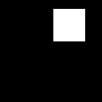
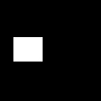

# Simple data set for image segmentation tasks

I was searching for a simple dataset where I can have an object and (obviously) its corresponding mask (white color - object present, black color - object not present). I found nothing what I was expecting, therefore I created this simple script to generate 3 different objects - triangles, rectangles and circles - which I generate in random color and are randomly placed on the canvas, then comes the corresponding mask. You can just run the Python script on your machine (or you can download some samples I created and stored in '[shapes](shapes)' folder). **Please, don't forget to change following parametersbefore you run the script on your local machine:**

```python
NUM_IMAGES = 15
STORAGE_PATH = 'E:\\data_sets\\shapes\\'
```
Here are couple of examples (original/mask pairs):

 
 

 
 

 
 

If you use this code to generate your own data, always cite this source , please. Thx!
