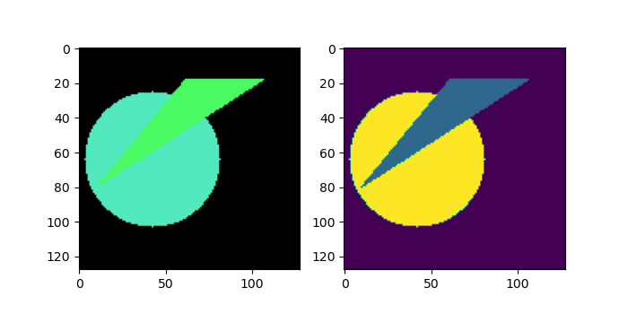

# 1. Simple data set for image segmentation tasks (**Enhanced version**)

This version randomly generates up to 3 objects per image. Then, the mask is created accordingly. Each object has a different mask: where a **triangle** is present, the mask has the value "1"; where a **rectangle** is present, the mask has the value "2"; and where a **circle** is present, the mask has the value "3". In all other areas where there are no objects present, the mask has a value of "0". You can find more examples below for your intuition:





Data is already splited into dev (4500 images) and test pairs (500 images). You can download it from [here](data_set_v2/data_set_v2.zip).

# 2. Simple data set for image segmentation tasks

I was searching for a simple dataset where I could have an object and its corresponding mask (white for object present, black for object not present). I found nothing that met my expectations, so I created this simple script to generate three different objects - triangles, rectangles, and circles. They are generated in random colors and positions on the canvas, and the corresponding masks are also generated. You can run the Python script on your local machine or download some samples I've created and stored in the folder .

**Please, don't forget to change following parameters before running the script on your local machine:**

```python
NUM_IMAGES = 15
STORAGE_PATH = 'E:\\data_sets\\shapes\\'
```
Here are a couple of examples of original/mask pairs:

 
 

 
 

 
 

If you use this code to generate your own data, please remember to cite this source as . Thank you!
